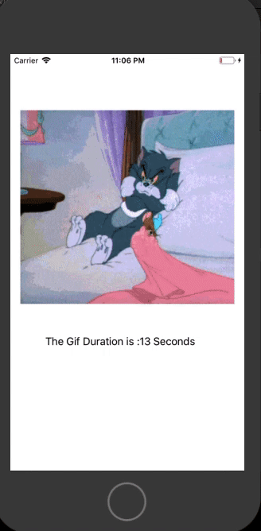

# UIGifView

[](https://travis-ci.org/DarkKnight29/UIGifView)
[](https://cocoapods.org/pods/UIGifView)
[](https://cocoapods.org/pods/UIGifView)
[](https://cocoapods.org/pods/UIGifView)

## Example

To run the example project, clone the repo, and run `pod install` from the Example directory first.

## Demo


## Installation

UIGifView is available through [CocoaPods](https://cocoapods.org). To install
it, simply add the following line to your Podfile:

```ruby
pod 'UIGifView'
```

## Author

DarkKnight29, phani.s2909@icloud.com

## License

UIGifView is available under the MIT license. See the LICENSE file for more info.
